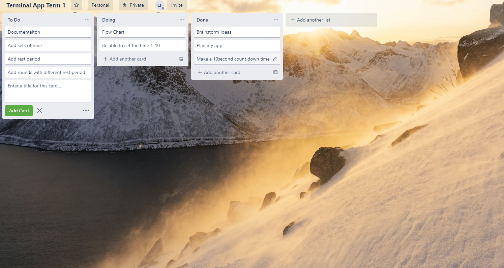

# README
## Instructions for Timer App

### Installation

* unzip folder into root directory
* using the command line navigate to the folder that has the src code
* in the command line run ./main.py
* for in app instructions run ./main.py --instruct
* for in app help run ./main.py --help
  

This app requires that python be installed on the computer with access to the command line

### Features of the application:

The application shall prompt the user to make a choice between two options one for a static timer that has been set to Tabata protocol. That is 20seconds work, 10 seconds rest for 8 sets. The user has the option to enter how many rounds they would like and under this protocol the rest between rounds is 60 seconds.

All information entered must be using numeral digits ie. 1,2,23,50

For the second option custom timer. The application runs exactly the same. However the using can completely customize the timer settings for all times. Work, rest, number of sets, number of rounds and rest between rounds. 

All information entered must be using numeral digits ie. 1,2,23,50

If any invalid entry is entered the program will exit and the user shall have to start the process again. 

Upon completion of the timer the application shall end.

Note the terminal needs to be open to 3/4 screen to present the timer optiminally and get the full readout.

For cancelling the timer, please enter ctril+c and this shall terminate the program mid operation

## Test Applications

### Test One

#### Test Case One

1. run app using ./main.py
2. select 3
3. Program prompts user to select 1 or 2

#### Test Case Two

1. run app using ./main.py
2. select 1
3. Program starts the Tabata function asking for Rounds

### Test Two

#### Test Case One

1. run app using ./main.py
2. select 2
3. Program prompts user to enter a number for sets
4. User enters $%
5. Program exits telling the user that they entered and invalid input and to start again

#### Test Case Two

1. run app using ./main.py
2. select 2
3. Program prompts user to enter a number work time in seconds
4. User enters 30
5. Program prompts user to enter rest time

## Manual Testing

| ID | Feature                                                      |
|----|--------------------------------------------------------------|
| 1  | User can enter a number in   seconds for timer and for rest  |
| 2  | User can select from the menu   option                       |
| 3  | Error check in customized timer                              |
| 4  | Error check in Tabata time                                   |

| ID | Feature ID | Test Case                                                                     | Test Data                                                    | Expected Result                                                   | Acutal Result                                                     | Status   | Comments                            |
|----|------------|-------------------------------------------------------------------------------|--------------------------------------------------------------|-------------------------------------------------------------------|-------------------------------------------------------------------|----------|-------------------------------------|
| 1  | 1          | check results on entering times less then 10 seconds                          | 10,10                                                        | timer counts to 10                                                | - As expected                                                     | passed   |                                     |
| 2  | 1          | check results on entering times greater then 10 seconds                       | 20,20                                                        | Timer counts to 20 for rest and   for work                        | Error message on rest timer   about 10 seconds                    | critical | Functionality risk, fix immediately |
| 3  | 1          | Check results on entering on entering a invalid input                         | #$ entered instead of integer                                | program exits with a message                                      | program exists with a message                                     | passed   |                                     |
| 4  | 2          | User enters a valid input                                                     | 1 or 2 entered                                               | Appropriate menu selected                                         | Appropriate menu selected                                         | passed   |                                     |
| 5  | 2          | User enter an invalid input                                                   | tested with lettter, numbers   outside range and punctuation | User to be promped to enter a   valid input                       | User to be promped to enter a   valid input                       | passed   |                                     |
| 6  | 3          | Enter uses an invalid entry into   customized timer                           | t, #, $                                                      | Program exits with invalid   message                              | Program exits with invalid   message                              | passed   |                                     |
| 7  | 3          | Enter uses an invalid entry into   customized checked for all variable inputs | t, #, $, aa, yy                                              | Program exits with invalid   message                              | Program exits with invalid   message                              | passed   |                                     |
| 8  | 3          | User enters valid inputs                                                      | 10,20,10,30                                                  | Time starts and counts down   squentially and exits on completion | Time starts and counts down   squentially and exits on completion | passed   |                                     |
| 6  | 4          | Enter uses an invalid entry into   Tabata timer                               | t, #, $                                                      | Program exits with invalid   message                              | Program exits with invalid   message                              | passed   |                                     |
| 7  | 4          | Enter uses an invalid entry into   Tabata time for rounds                     | t, #, $, aa, yy                                              | Program exits with invalid   message                              | Program exits with invalid   message                              | passed   |                                     |
| 8  | 4          | User enters valid inputs                                                      | 2                                                            | Time starts and counts down   squentially and exits on completion | Time starts and counts down   squentially and exits on completion | passed   |                                     |

# Colin Forster Software Development Plan

## Project Scope

This application is designed to serve as a multi purpose timer, with features enabling it to have different timing parameters for work time, rest time, sets, as well as how many “rounds” of the sets.

The timer functionality of this application will enable users to do interval training, as well as having the utility to be customizable to suit their plans and needs. Visually bigger numbers using ascii art shall be used to help the user to be able to see what the current timer is at as well as using sound prompts between the seconds to provide a secondary cue.

For ease of use a preset timer has also been included as well as the customizable timer. The preset timer has been designed to be used during the “tabata” protocol. Whereby the user has a 20sec work period followed by a 10sec break period. This sequence is followed for 8 repetitions until that round is complete, the user has the choice of deciding to 1 or more rounds under this protocol. 

Whilst fitness timing was the primary use in mind when designing this app it also has straight timing functionality that is only limited by the creativity of the user and what they want to achieve. 

A user shall run the application, then selecting a tabata timing or a customizable timer. From this point depending on the choice the user shall have a series of options for what they want to do depending on that choice. In the tabata protocol only the number of rounds is customizable. Whereas in the customized feature, every aspect of the timing as well as sets and rounds can be customized. All units for the timing feature is in seconds and the sets and rounds are to be entered as whole numbers.

## Features

### Tabata timer
The tabata timer utilises loops in a function as well as a dictionary for ascii art input. The timings in this function are hardcoded with the only user input coming for the rounds. A try and except feature has been included in this function and if the user input is invalid the function shall exit telling the user why. The process of the loops used in this feature is to take the time as an integer, use this integer to find the corresponding dictionary entry and print this to the screen. After one second the screen is cleared. And the next sequential number is printed.

### Customizable timer
The custom timer like the tabata timer utilises ascii art to print a timer on the screen as well as sets and rounds, and rest periods. The only difference between the two timers is that with this timer all of the time, sets and rounds features can be customized. A try and except feature is also included and will exit the program if the user puts an invalid entry in. The sets loop is the outside loop with the timer loop running internally so that the correct time per set is achieved with appropriate rest periods. 

### Option menu
The options menu is created with a loop in mind and error handling to ensure that the user enters the correct options. A test is conducted to run while a string is empty and then also to check if a valid input has been entered. If a valid input is entered then the loop shall call the relevant timer function prompting users for any necessary inputs required for that function. This feature also instructs the user for the correct information so they can understand the input that is required.

## User interaction and experience

The user on starting the app shall be prompted to pick an option of 1 or 2 regarding which timer they want.

This shall be done through user input and using the keyboard.

Two while loops have been used at this juncture to ensure the correct input is inserted. If it is not, then the user shall be prompted for a valid input until they enter one.

If tabata timer is selected then the user shall be prompted to enter the rounds of the tabata time.

The tabata timer then shall start a timer with seconds as well as sets. Counting up. The configuration for tabata timing is 20seconds work/exercise, 10seconds rest for 8 sets. A period of rest of 60seconds is then observed between rounds if more then one round is selected.

For the custom timer the user is asked to input work time, rest time, number of sets, number of rounds and rest between rounds. The timer then counts like the previous timer utilising functions and loops as well as sound prompts. For both timers a try and except feature is implemented and if an invalid input is entered then the app exits printing a note to the screen that an invalid input was entered and to start again.

Upon completion of the timer the app closes.

## Flow Chart

## Project management process

